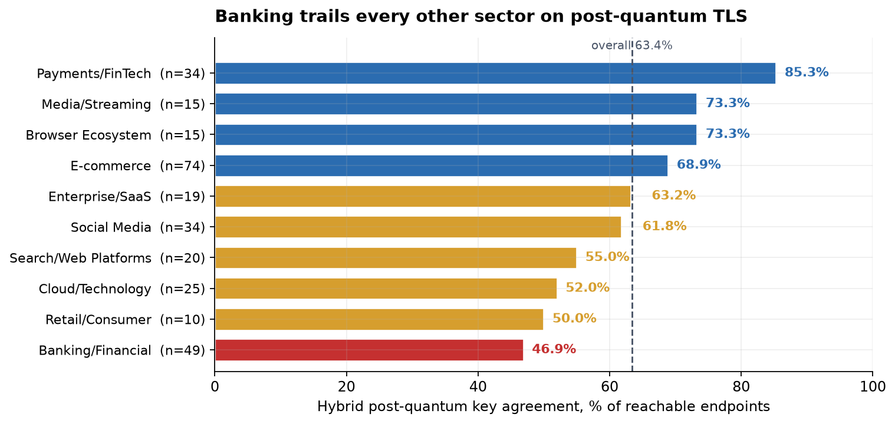
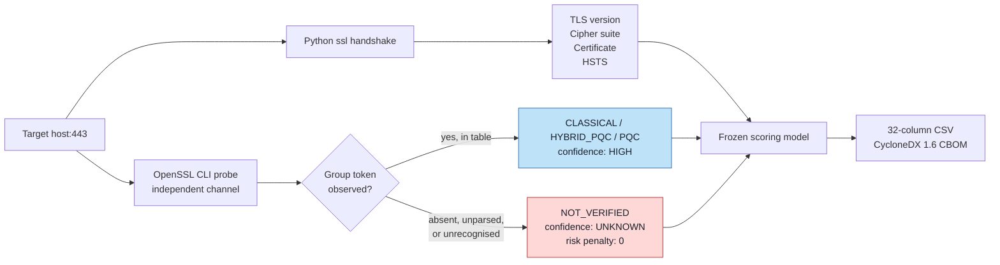
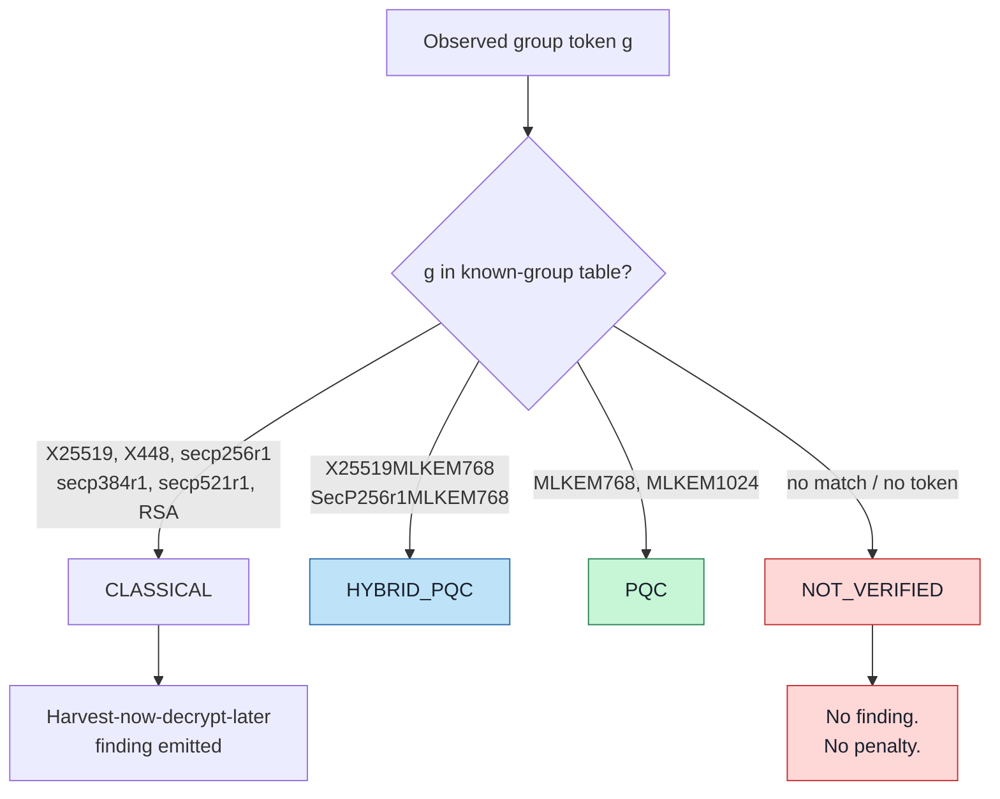
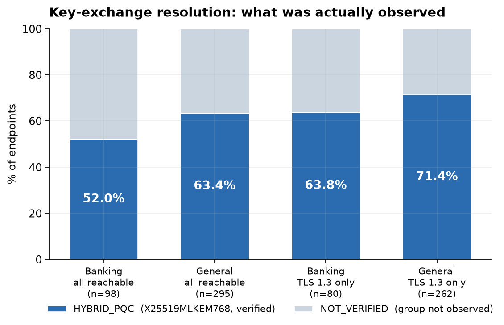
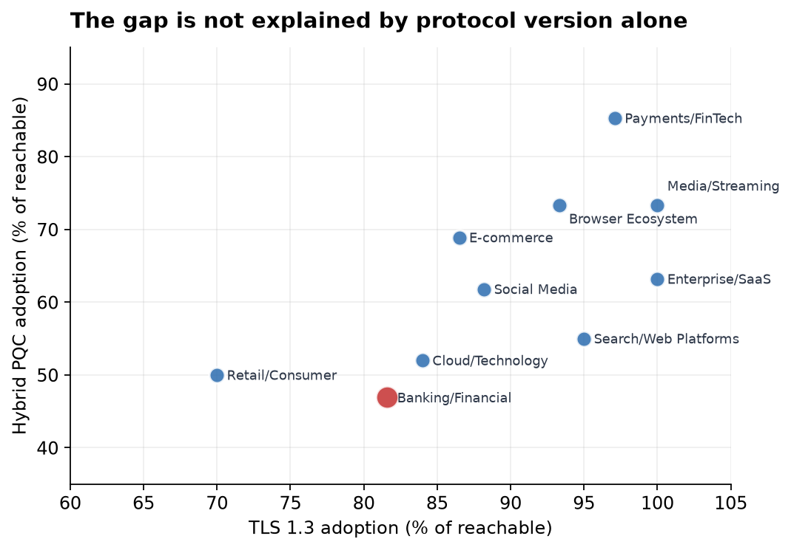
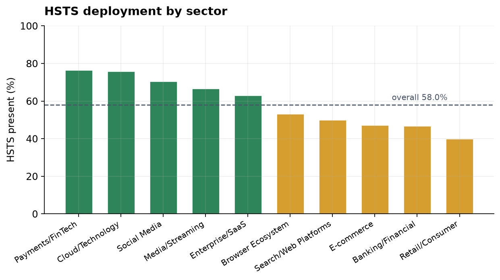
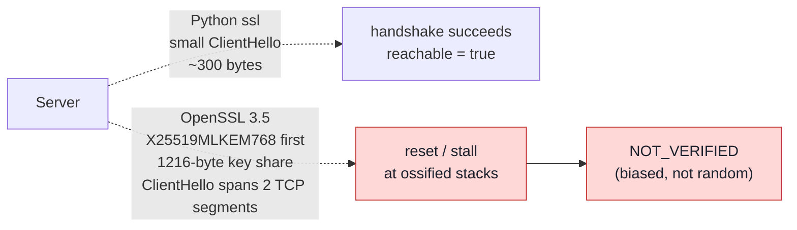

# AegisGuard

**An empirical framework for assessing post-quantum readiness in public-facing TLS infrastructure.**

> *"Measure what you can prove. Never infer what you cannot observe."*

AegisGuard is a non-intrusive TLS/PQC measurement tool built around one constraint: a scanner that cannot observe the negotiated key-exchange group must say so, rather than reporting the absence of evidence as evidence of weakness.

📄 **Paper** · 📊 **400 endpoints measured** · 🔬 **All per-endpoint records released**

---

## The headline finding



Banking/Financial trails **all nine** other measured sectors — 38.4 points behind Payments/FinTech, which processes the same transactions. The result replicates across two disjoint banking samples (46.9% and 52.0%).

---

## Why this tool exists

TLS 1.3 always negotiates a key exchange over some named group, but that group is not exposed by every client API — Python's `ssl` reports the protocol version and cipher suite but **not** the negotiated group. Tools that fill the gap by inference produce confident, wrong answers:

| Inference | Why it's wrong |
|---|---|
| `TLS_AES_256_GCM_SHA384` → classical KEX | The suite constrains the AEAD, not the key agreement |
| RSA-2048 certificate → classical KEX | Certificate algorithm and key exchange are independent dimensions |
| TLS 1.3 negotiated → post-quantum | TLS 1.3 is evidence of neither PQC nor classical |
| Group not observed → "not quantum-safe" | Absence of evidence, reported as a vulnerability |

That last row is the failure mode that matters. It inflates vulnerability counts in exactly the direction that makes a tool look valuable, and the output is unfalsifiable because the missing evidence is never surfaced.

### How AegisGuard resolves it



The key exchange is resolved from an **independent measurement channel**, never inferred from correlates. Anything unobserved becomes `NOT_VERIFIED` — a first-class outcome carrying **zero risk penalty**.

---

## Classification policy



**No *harvest-now-decrypt-later* finding is ever emitted unless a classical group was positively observed.**

Three separation rules are enforced in code: certificate algorithms may not inform the key exchange; the cipher suite constrains only the AEAD; protocol version implies nothing about the group.

---

## Study results

Two disjoint campaigns, 2026-08-22, single vantage in India (OpenSSL 3.5.7, CPython 3.14).



| | Dataset A (banking) | Dataset B (10 sectors) |
|---|---|---|
| Targets | 100 | 300 |
| Reachable | 98 | 295 |
| TLS 1.3 | 81.6% | 88.8% |
| **Hybrid PQC** | **52.0%** | **63.4%** |
| Hybrid PQC (TLS 1.3 only) | 63.8% | 71.4% |
| `NOT_VERIFIED` | 48.0% | 36.6% |
| HSTS present | 50.0% | 58.0% |
| Expired certificates | 0 | 0 |

Every positively verified group was `X25519MLKEM768`. No `SecP256r1MLKEM768` and no pure ML-KEM group was observed anywhere.

### The gap is not just protocol lag



Banking's TLS 1.3 share (81.6%) is only 7.2 points below the general population's — but conditioning on TLS 1.3 *preserves* the key-exchange gap (63.8% vs 71.4%). Sectors at ~100% TLS 1.3 span 63–73% hybrid adoption, so protocol version and PQC readiness are genuinely separate axes.

### HSTS



Roughly half of banking endpoints omit a header defending against protocol downgrade and cookie hijacking — a finding independent of, and more immediately actionable than, the post-quantum results.

---

## ⚠️ Known limitations — read before reusing the data

These are disclosed in the paper and **are not resolved** in the released datasets.

### 1. No classical group was resolved anywhere (393 reachable observations)

Every TLS 1.3 session negotiates *some* group, and 104 TLS 1.3 sessions returned `NOT_VERIFIED` — so this is an instrument property, not a property of the Internet.



Under this hypothesis the OpenSSL probe fails *precisely at endpoints not supporting the hybrid group*, making `NOT_VERIFIED` a systematically biased stratum rather than random residue.

**Consequence: hybrid adoption figures are a lower bound, and classical adoption is unmeasured.** Fixing this requires persisting the probe's exit status per endpoint, retrying with `-groups X25519`, and cross-checking against a client that reports the group without a second connection.

### 2. Certificate algorithm fields are placeholder constants

`pyOpenSSL`/`cryptography` are in `requirements.txt` but were absent from the environment during both runs, so `tls_probe.py` fell back to a hard-coded `RSA` / `2048` / `sha256WithRSAEncryption (estimated)`. Those columns are uniform across all 393 reachable records and carry no information. They are excluded from all published results. **Install the full requirements before re-running.** Post-quantum *signature* adoption is therefore unmeasured by this study.

### 3. The two campaigns used different trust configurations

Dataset A used the Windows system certificate store; Dataset B ran after the prober was changed to load an explicit `certifi` bundle. Both Dataset A failures were re-verified under the corrected configuration and persisted, but a unified re-run is needed before treating the datasets as strictly comparable on reachability.

### 4. Sampling is not probabilistic

Manually curated named organisations, not a Tranco-style frame. Results characterise recognisable institutions, not "the web." Several sectors have n ≤ 20 — Retail/Consumer's 50.0% rests on ten endpoints.

### 5. Single vantage, single two-hour window, one endpoint per organisation

CDN and anycast infrastructure serve region-specific configurations. A bank's brochureware site is not its transactional origin.

---

## Install

```bash
git clone https://github.com/jayant-kumar-dev/AegisGuard-Quantum-Safe-PQC-Scanner
cd AegisGuard-Quantum-Safe-PQC-Scanner
python -m venv .venv
source .venv/bin/activate        # Windows: .venv\Scripts\activate
pip install -r requirements.txt
```

**OpenSSL CLI is a hard requirement** — the key-exchange probe shells out to it:

```bash
openssl version    # need 3.x; 3.5+ to observe hybrid groups
```

Without it, every scan correctly returns `NOT_VERIFIED` rather than guessing — intended behaviour, but yields no data.

---

## Usage

```bash
# Web dashboard + API
python app.py                          # http://localhost:8000

# Batch studies (input CSV needs a `domain` column)
python run_bank_study.py banks.csv results.csv
python run_site_study.py               # reads sites_300.csv

# Regenerate paper figures / README charts
python make_figures.py
python make_readme_assets.py
```

Both runners pace at ~1 connection/second, retry once with a `www.` prefix on **network-layer** errors only (DNS failure, timeout, refused, reset), and never retry TLS-layer errors — a certificate or renegotiation failure is a property of the endpoint and is preserved as an observation.

---

## Repository layout

```
scanner/
  tls_probe.py       TLS handshake, OpenSSL KEX probe, certificate parsing, HSTS
  pqc_analyzer.py    four-valued classification (the core policy)
  risk_scorer.py     frozen deterministic scoring
  cbom_generator.py  CycloneDX 1.6 cryptographic bill of materials
  exporters.py       32-column research schema
  intelligence.py    CVE matching, HNDL timeline
app.py                        FastAPI application
run_bank_study.py             100-endpoint banking campaign
run_site_study.py             300-endpoint multi-sector campaign
make_figures.py               paper figures (PDF)
make_readme_assets.py         README charts (PNG)
results.csv                   Dataset A, per-endpoint (100 × 32)
site_study_results.csv        Dataset B, per-endpoint (300 × 32)
banks.csv / sites_300.csv     target lists
```

---

## Scope and ethics

AegisGuard performs **only** DNS resolution, a TCP connection to port 443, a standard TLS handshake, certificate inspection, and an HTTP `HEAD` for the HSTS header. No exploitation, authentication testing, fuzzing, enumeration, brute-forcing, or load generation. Each host is contacted at roughly one connection per second.

All measured targets are public-facing endpoints of identifiable organisations. **Scan only infrastructure you own or have permission to test.**

---

## Authors

**Jayant Kumar** (corresponding) — conceptualization, implementation, measurement, analysis
**Nitin Soni** — supervision, methodology, interpretation, review

Department of Computer Applications, Sobhasaria Group of Institutions, Sikar, Rajasthan, India


